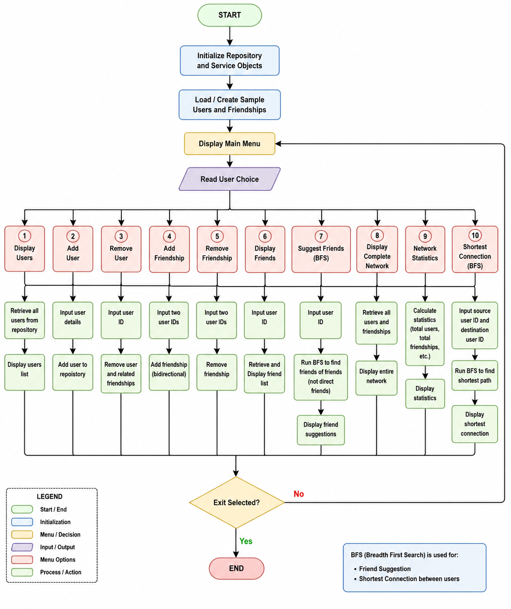

# 🚀 Social Media Friend Suggestion System

A **Java Low-Level Design (LLD)** project that simulates a social networking platform and recommends friends using the **Breadth-First Search (BFS)** graph traversal algorithm.

---

## 📌 Project Overview

The **Social Media Friend Suggestion System** models users and friendships as a graph. It enables users to create friendships, remove friendships, discover new friends through **BFS-based friend recommendation**, and find the **shortest connection path** between any two users.

This project demonstrates core Java programming concepts, Object-Oriented Programming (OOP), Graph Data Structures, and Low-Level Design principles.

---

## ✨ Features

- 👤 Add User
- ❌ Remove User
- 🤝 Add Friendship
- 💔 Remove Friendship
- 👥 Display All Users
- 📋 Display Friends
- 🔍 Friend Suggestion using Breadth-First Search (BFS)
- 🌐 Display Complete Social Network
- 📊 Network Statistics
- 🛣️ Shortest Connection Between Users (BFS)
- 📌 Menu-Driven Console Application

---

# 🏗️ System Flowchart

<p align="center">
    
</p>
---

## 🧠 Algorithm Used

### Breadth-First Search (BFS)

BFS explores the friendship graph level by level.

It is used for:

- Friend Recommendation
- Shortest Connection Between Users
- Graph Traversal

---

## 🛠️ Technologies Used

| Technology | Purpose |
|------------|---------|
| Java | Programming Language |
| OOP | Object-Oriented Design |
| HashMap | User Repository |
| HashSet | Friend Storage |
| Queue | BFS Traversal |
| LinkedList | Queue Implementation |
| Graph | Social Network Representation |

---

## 📂 Project Structure

```text
SocialMediaFriendSuggestion
│
├── FriendSuggestionService.java
├── Main.java
├── User.java
├── UserRepository.java
├── README.md
└── screenshots
      └── flowchart.png
```

---

## ⚙️ Functional Modules

### 👤 User Management

- Add User
- Remove User
- Display Users

---

### 🤝 Friendship Management

- Add Friendship
- Remove Friendship
- Display Friends

---

### 🔍 Friend Recommendation

Uses **Breadth-First Search (BFS)** to recommend users who are connected through mutual friendships.

---

### 🛣️ Shortest Connection

Finds the shortest friendship path between two users using BFS.

Example:

```text
Alice
   ↓
Bob
   ↓
David
```

Output

```text
Alice → Bob → David
```

---

### 📊 Network Statistics

Displays:

- Total Users
- Total Friendships

---

## 🎯 Learning Outcomes

This project helped in understanding:

- Object-Oriented Programming (OOP)
- Encapsulation
- Repository Pattern
- Service Layer Design
- Java Collections Framework
- Graph Data Structure
- Breadth-First Search (BFS)
- Low-Level Design Principles

---

## 🚀 Future Enhancements

- User Authentication
- Friend Request System
- Mutual Friend Ranking
- GUI using JavaFX
- Database Integration (MySQL)
- Spring Boot REST API
- Web Application Version
- AI-Based Friend Recommendation

---

## 👨‍💻 Author

**Rageshwaran P**

B.E. Electrical and Electronics Engineering

Kalaignarkarunanidhi Institute of Technology

GitHub:
https://github.com/Rageshwaran13

---

## ⭐ If you like this project

Give this repository a ⭐ on GitHub!

It motivates me to build more Java projects.
